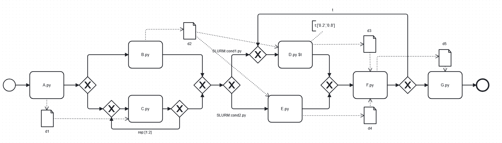

# SLURMminer_Engine

An automated tool for converting BPMN diagrams to SLURM-ready scripts using Python and Bootstrap.

## Getting Started

Follow these steps to set up and run the SLURMminer_Engine on your system.

### 1. Installation Procedure

To set up SLURMminer_Engine:

- **Install Node.js:**
    - Download the Node.js installer from the [official website](https://nodejs.org/en/download/).
    - Follow the installation instructions, ensuring both Node.js and NPM (Node Package Manager) are installed.
    - Verify the installation by opening a command prompt (or PowerShell) and running:
      ```bash
      node -v
      ```

- **Verify Python Installation:**
    - Ensure Python is installed on your system by running:
      ```bash
      python --version
      ```

- **Check for PIP:**
    - Confirm that PIP, the Python package manager, is installed by running:
      ```bash
      pip --version
      ```

- **Clone the Repository:**
    - Clone the SLURMminer_Engine repository from GitHub:
      ```bash
      git clone https://github.com/zasab/SLURMminer_Engine.git
      ```
    - Open the project in your preferred Integrated Development Environment (IDE).

### 2. Execution Procedure

To run SLURMminer_Engine, follow these steps:

1. **Install Required Packages:**
    - Run the `app.py` script. Then, install the necessary packages listed in the `requirements.txt` file using:
      ```bash
      pip install flask matplotlib networkx pm4py==2.3.3
      ```

2. **Update `pm4py` Package Files:**
    - To parse BPMN files, we use the `pm4py` package. Replace the following files in the `pm4py` package with the custom versions provided:
        - **File to Update:**  
          `\pm4py\objects\bpmn\importer\variants\lxml.py`  
          **Replace With:**
          [`/custom_pm4py/lxml.py`](./custom_pm4py/lxml.py)

        - **File to Update:**  
          `\pm4py\objects\bpmn\obj.py`  
          **Replace With:**
          [`/custom_pm4py/obj.py`](./custom_pm4py/obj.py)

   Make sure to update these files to ensure compatibility and proper functionality.

3. **Run the Application:**
    - Execute the `app.py` script:
      ```bash
      python app.py
      ```
    - You should see the following output:
      ```plaintext
      * Serving Flask app 'app'
      * Debug mode: on
      WARNING: This is a development server. Do not use it in a production deployment. Use a production WSGI server instead.
      * Running on http://127.0.0.1:5000
      Press CTRL+C to quit
      * Restarting with stat
      ```

    - Open your web browser and navigate to [http://127.0.0.1:5000](http://127.0.0.1:5000). Here, you can upload your input SlurmBPMN file, and the tool will generate the corresponding SLURM scripts in a newly created folder named `slurm_scripts`.


## Example

This section demonstrates how SLURMminer_Engine can be used to convert SlurmBPMN diagrams into SLURM scripts. A SlurmBPMN diagram is a type of customized BPMN that includes all the necessary information for executing a workflow on SLURM. To create and visualize an input SlurmBPMN diagram, you can use the [bpmn.io](https://demo.bpmn.io/new) online tool. This tool allows you to easily draw BPMN diagrams, which can then be customized to serve as input for SLURMminer_Engine.

### Example SlurmBPMN Diagram

Below is a sample SlurmBPMN diagram that represents a simple workflow (the BPMN file is available here: ):



The SlurmBPMN model outlines the steps for analyzing sorting algorithms. It begins by selecting a sorting algorithm `A.py`, followed by generating data and implementing it with `C.py`. The implementation is refined through one or two repetitions (`rep:[1:2]`). Next, an XOR gateway uses `Cond1.py` and `Cond2.py` to decide the next step based on data size: larger datasets trigger `D.py`, while smaller ones trigger `E.py`. Afterward, data is collected and analyzed to assess the algorithm's efficiency. Each task is linked to a script executed using the `srun` command on SLURM.
    
| Label   | Name                                               |
|---------|----------------------------------------------------|
| $A.py$  | Selection of Sorting Algorithm                     |
| $B.py$  | Generate Data                                      |
| $C.py$  | Implement Algorithm                                |
| $d_1$   | Data dependency between $A.py$ and $C.py$          |
| $d_2$   | Data dependency between $B.py$, $D.py$, and $E.py$ |
| Cond1.py | Script for assessing data size condition 1        |
| Cond2.py | Script for assessing data size condition 2        |
| $D.py$  | Run First Experiment                               |
| $E.py$  | Run Second Experiment                              |
| $d_3$   | Data dependency between $D.py$ and $F.py$          |
| $d_4$   | Data dependency between $E.py$ and $F.py$          |
| $F.py$  | Collect Data                                       |
| $d_5$   | Data dependency between $F.py$ and $G.py$          |
| $G.py$  | Analysis of Results                                |

Customized SlurmBPMN uses XOR gateways (For more detailed information about BPMN structures, see [BPMN 2.0 Specification](https://www.omg.org/spec/BPMN/2.0)) for three main purposes:

1. **Condition-Based Execution:** Scripts like `Cond1.py` run on SLURM to check specific conditions. If the script returns a 0, the workflow continues along that path.
2. **Explicit Loops:** Tasks like `C.py` can be repeated a set number of times, either 1 or 2, ensuring `C.py` is executed in sequence for the selected number of repetitions.
3. **Implicit Loops:** Tasks like `D.py` can run simultaneously with different inputs (e.g., thresholds 0.2 and 0.8), allowing all variations to be processed in parallel.

### Generated SLURM Script
After uploading the SlurmBPMN file, click the 'Create Executable File' button to generate the output SLURM scripts. The tool generates a SLURM script that automates the workflow on a cluster environment. The final SLURM script `slurm_bpmn_example.sh` can be found here: 

```bash
#!/bin/bash

FILES_DIR=$(echo $RANDOM | md5sum | head -c 4)
FILES_DIR="OM2X5_$FILES_DIR"

job_id_723=$(sbatch --parsable 723_A.sh $FILES_DIR)
job_id_1373=$(sbatch --parsable --dependency=afterok:$job_id_723 1373_C.sh $FILES_DIR)
job_id_3031=$(sbatch --parsable --dependency=afterok:$job_id_723 3031_B.sh $FILES_DIR)
job_id_3283=$(sbatch --parsable --dependency=afterany:$job_id_3031:$job_id_1373 3283_cond1.sh $FILES_DIR)
job_id_2415=$(sbatch --parsable --dependency=afterany:$job_id_3031:$job_id_1373 2415_cond2.sh $FILES_DIR)
job_id_3072=$(sbatch --parsable --dependency=afterok:$job_id_2415 3072_E.sh $FILES_DIR)
job_id_4965=$(sbatch --parsable --dependency=afterok:$job_id_3283 4965_D.sh $FILES_DIR)
job_id_855=$(sbatch --parsable --dependency=afterok:$job_id_3283 855_D.sh $FILES_DIR)
job_id_5493=$(sbatch --parsable --dependency=afterany:$job_id_855:$job_id_3072 5493_ojs__aff_iloop__F.sh $FILES_DIR)
job_id_8132=$(sbatch --parsable --dependency=afterany:$job_id_3072:$job_id_4965 8132_FEV__aff_iloop__F.sh $FILES_DIR)
job_id_8359=$(sbatch --parsable --dependency=afterok:$job_id_5493,$job_id_8132 8359_G.sh $FILES_DIR)
```

In `slurm_bpmn_example.sh`, the first step is to create a unique directory name using a random string. This ensures that each time you submit the script to SLURM, the generated files are stored in a unique folder, which is important for managing files in workflow systems. The script begins by scheduling jobs without dependencies (`job_id_723`). It then schedules jobs that depend on `job_id_723` (`job_id_1373` and `job_id_3031`). Subsequent jobs are scheduled in sequence, ensuring all dependencies are met before they run. The final job (`job_id_8359`) is scheduled last, dependent on the completion of earlier tasks. 

The tool generates a unique random number to use as a reference for the job script name and job identifier (`jobid`) for managing dependencies. For example, the number `723` is added to `A`, creating the job script name `723_A`. This script contains all the necessary information, including the execution of `A.py` and its parameters.

Here’s a snippet of the `723_A.sh`:

```bash
#!/bin/bash

FILES_DIR=$1$2
mkdir $FILES_DIR

#SBATCH --mem-per-cpu=6G
#SBATCH --cpus-per-task=16
#SBATCH --nodes=2
#SBATCH --ntasks=2
#SBATCH --ntasks-per-node=1
#SBATCH --output=723_A_res_%j.txt

# Execute the Python script using srun
srun python3 A.py $FILES_DIR 0 $FILES_DIR/d1 1

if [ $? -eq 0 ]; then
    echo "0" >> "exit_code0_${SLURM_JOB_ID}.txt"
    exit 0
else
    echo "1" >> "exit_code1_${SLURM_JOB_ID}.txt"
    exit 1
fi
```

1. **SLURM Settings:** The script begins by setting up SLURM resource allocations, specifying memory per CPU, the number of CPU cores per task, the number of nodes, task distribution, and the output file for the job's results.
2. **Running the Python Script:** It then uses `srun` to execute `A.py`, passing in the directory for input and output files, along with the number of input (here 0) and output files (1) in a specified format.
3. **Logging and Exit:** Finally, the script checks if the Python script ran successfully. It logs the outcome (success or failure) to a file and exits with the corresponding status code.

In this example, the SlurmBPMN diagram is converted into a SLURM script, ready to be executed on a SLURM-managed HPC cluster.


